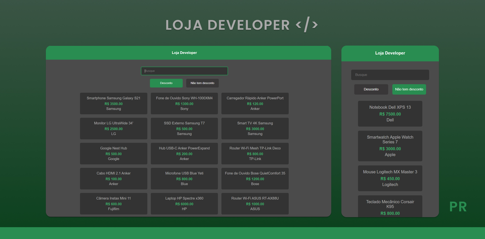

# Catálogo de Produtos com Filtro

Este projeto é uma aplicação web que exibe uma lista de produtos, permitindo filtrar por nome, marca, preço e disponibilidade de desconto. A aplicação é construída utilizando **HTML**, **CSS** e **JavaScript**.

## Funcionalidades

1. **Exibição de Produtos**  
   Mostra uma lista completa de produtos com informações como:
   - Nome
   - Preço
   - Marca
   - Indicação de produtos com desconto

2. **Filtros**  
   Permite buscar produtos com base nos seguintes critérios:
   - **Nome**: Insira parte ou todo o nome do produto.
   - **Marca**: Insira o nome da marca.
   - **Preço**: Pesquise por um valor específico.
   - **Desconto**: Insira a palavra "desconto" para exibir produtos com desconto.

3. **Listagem por Categoria**  
   - **Produtos com Desconto**: Exibe apenas os produtos que estão com desconto.  
   - **Produtos sem Desconto**: Exibe produtos sem desconto.

4. **Interatividade**  
   O sistema é dinâmico e atualiza a lista de produtos em tempo real conforme os critérios de busca.

## Tecnologias Utilizadas

- **HTML**: Estrutura da aplicação.
- **CSS**: Estilização e design responsivo.
- **JavaScript**: Funcionalidade e interatividade da aplicação.

## Como Usar

1. Clone o repositório para sua máquina local:
   ```bash
   git clone https://github.com/seu-usuario/nome-do-repositorio.git
   ```
### Licença
 Este projeto está disponível para uso pessoal e educacional.